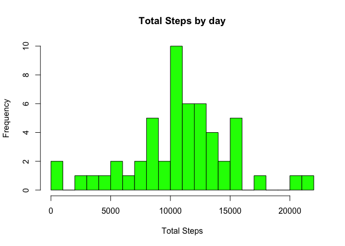
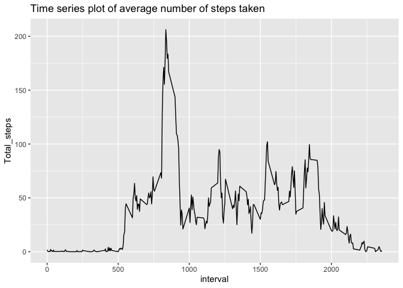
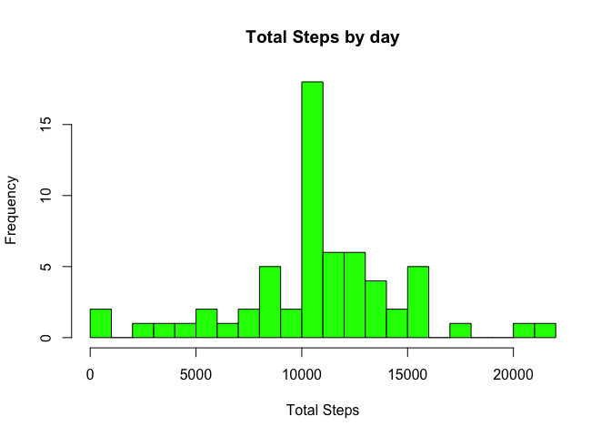
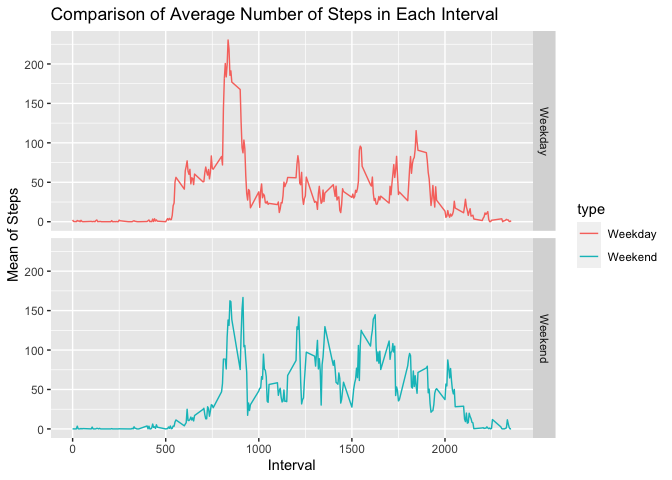

```r
knitr::opts_chunk$set(echo = TRUE)
```
## Loading and preprocessing the data
Read Data

```r
data<-read.csv("activity.csv")
head(data)
```

```
##   steps       date interval
## 1    NA 2012-10-01        0
## 2    NA 2012-10-01        5
## 3    NA 2012-10-01       10
## 4    NA 2012-10-01       15
## 5    NA 2012-10-01       20
## 6    NA 2012-10-01       25
```

Histogram of the total number of steps taken each day

```r
library(dplyr)
```

```
## 
## Attaching package: 'dplyr'
```

```
## The following objects are masked from 'package:stats':
## 
##     filter, lag
```

```
## The following objects are masked from 'package:base':
## 
##     intersect, setdiff, setequal, union
```

```r
library(ggplot2)
k<-data %>% select(date,steps) %>% group_by(date) %>% summarise(Total_steps=sum(steps))%>% na.omit()
hist(k$Total_steps,breaks=25,xlab="Total Steps",main="Total Steps by day",col="green")
```

<!-- -->

## What is mean total number of steps taken per day?
Mean number of steps taken each day

```r
mean(k$Total_steps)
```

```
## [1] 10766.19
```
Median number of steps taken each day

```r
median(k$Total_steps)
```

```
## [1] 10765
```
## What is the average daily activity pattern?
Time series plot of the average number of steps taken

```r
z<-data %>% select(interval,steps) %>% na.omit() %>% group_by(interval) %>% summarise(Total_steps=mean(steps))
g<-ggplot(z,aes(interval,Total_steps))+geom_line()+ggtitle("Time series plot of average number of steps taken")
print(g)
```

<!-- -->
The 5-minute interval that, on average, contains the maximum number of steps

```r
z[which(z$Total_steps==max(z$Total_steps)),]
```

```
## # A tibble: 1 x 2
##   interval Total_steps
##      <int>       <dbl>
## 1      835        206.
```
## Imputing missing values
Code to describe and show a strategy for imputing missing data
Number of missing values in the data(according to date)

```r
sum(is.na(data$date))
```

```
## [1] 0
```
Devise a strategy for filling in all of the missing values in the dataset. The strategy does not need to be sophisticated. For example, you could use the mean/median for that day, or the mean for that 5-minute interval, etc.

```r
replace_mean<-function(x){replace(x,is.na(x),mean(x,na.rm=TRUE))}
data_mean<-data %>% group_by(interval) %>% mutate(steps=replace_mean(steps))
head(data_mean)
```

```
## # A tibble: 6 x 3
## # Groups:   interval [6]
##    steps date       interval
##    <dbl> <chr>         <int>
## 1 1.72   2012-10-01        0
## 2 0.340  2012-10-01        5
## 3 0.132  2012-10-01       10
## 4 0.151  2012-10-01       15
## 5 0.0755 2012-10-01       20
## 6 2.09   2012-10-01       25
```
Histogram of the total number of steps taken each day after missing values are imputed

```r
dat<-data_mean %>% group_by(date) %>% summarise(Total_steps=sum(steps))
hist(dat$Total_steps,breaks=25,xlab="Total Steps",main="Total Steps by day",col="green")
```

<!-- -->
Comparison between old and new mean and median

```r
oldmean <- mean(k$Total_steps, na.rm = TRUE)
newmean <- mean(dat$Total_steps)
# Old mean and New mean
oldmean
```

```
## [1] 10766.19
```

```r
newmean
```

```
## [1] 10766.19
```

```r
oldmedian <- median(k$Total_steps, na.rm = TRUE)
newmedian <- median(dat$Total_steps)
# Old median and New median
oldmedian
```

```
## [1] 10765
```

```r
newmedian
```

```
## [1] 10766.19
```
## Are there differences in activity patterns between weekdays and weekends?
Panel plot comparing the average number of steps taken per 5-minute interval across weekdays and weekends
1. Convert date into days and label them as weekdays and weekends

```r
data_mean$date<-as.Date(as.character(data_mean$date))
data_mean$type<-ifelse(weekdays(data_mean$date)=="Saturday" | weekdays(data_mean$date)=="Sunday", "Weekend", "Weekday" )
```
2. Plot the graph

```r
data_type<-aggregate(data_mean$steps,by=list(data_mean$type,data_mean$interval),na.omit(mean))
names(data_type)=c("type","interval","steps")
ggplot(data_type, aes(x=interval, y=steps, color=type)) + geom_line()+
     facet_grid(type ~.) + xlab("Interval") + ylab("Mean of Steps") +
     ggtitle("Comparison of Average Number of Steps in Each Interval")
```

<!-- -->
